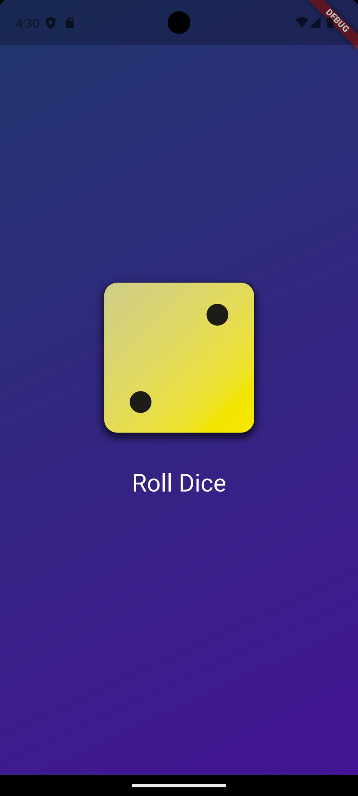

# 🎲 Dice Roller App

A simple and fun dice roller built with **Flutter**. Tap the dice to roll and get a random result!

## App Preview


## 🚀 Features

- 🎯 Random dice number generation
- 🎨 Colorful gradient background
- 🖱️ Interactive button to roll the dice
- 💡 Clean and modular Flutter code

## 📁 Project Structure

```
lib/
├── main.dart                # App entry point
├── gradient_container.dart # Background gradient widget
└── dice_roller.dart        # Core dice roller logic and UI
```

## 🛠️ Getting Started

### Prerequisites

- Flutter SDK: [Install Guide](https://flutter.dev/docs/get-started/install)
- Dart SDK

### Run Locally

```bash
git clone https://github.com/PyWise/roll-dice-app.git
cd flutter_dice_roller
flutter pub get
flutter run
```

## 📦 Dependencies

> No external dependencies — just Flutter and Dart!

## 🙌 Credits

Developed with ❤️ using [Flutter](https://flutter.dev).
